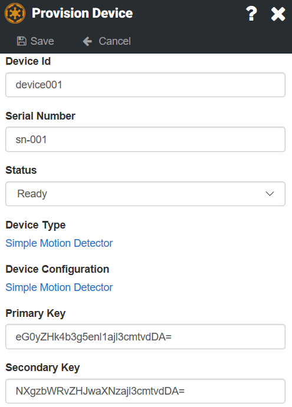

# Security Fields

Once you have identified your device by locating its [device id](../Messaging/Parsing/DeviceIdParsing.md) you 
will need to [locate](LocatingSecurityField.md) the security field.

The security field is a piece of the message that contains information that only the device would know or 
a specified value that could only be constructed with information that only the device has access to.

It is important to protect your access keys, if they become compromised a malicious device or piece of software could impersonate your device. 

When you create your devices you have two access keys associated with them, a primary and secondary keys. We provide
two keys to let you updates your keys without any down time.  Either key can be used to authenticate your device.



When you add a device these keys will be generated for you, however you can modify them to be anything you want.

The initial keys are generated and stored as a Base64 encoded value using the following algorithm within the browser
or device manager.
```
btoa(Math.random().toString(36).substring(2) + (new Date()).getTime().toString(36))
```

Although the initial access keys are base 64 encoded, you can replace them with simple strings, however you won't be able to use those 
simple strings with [SAS](SAS.md) authentication.

Once the primary and secondary keys have been created they can be used in one of two approaches for authenticating your devices:
* [Access Key](AccessKey.md) - The value in the primary or secondary key are sent in plain text somewhere in your message, this is only recommended if your messages are encrypted some some sort of [transport layer security](https://en.wikipedia.org/wiki/Transport_Layer_Security) (TLS)   
* [Basic Access Authentication](BasicAuth.md) - The value in the primary or secondary key are sent in plain text somewhere in your message, this is only recommended if your messages are encrypted some some sort of [transport layer security](https://en.wikipedia.org/wiki/Transport_Layer_Security) (TLS)   
* [Shared Access Signatures](SAS.md) - A token that is created and signed at the device level, that signature is then recreated on the server and the results are compared if they match we know that only a device with that key could have created the signed token.
 
If you have additional needs for a different type of security field, please [contact us](https://support.nuviot.com/contactus?source=securityfields) to discuss your needs.